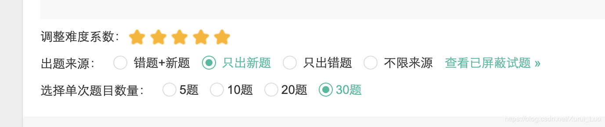
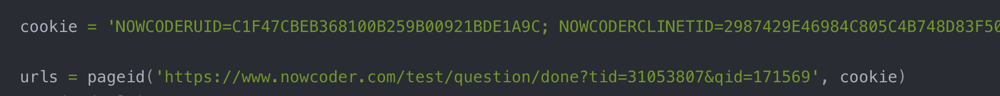
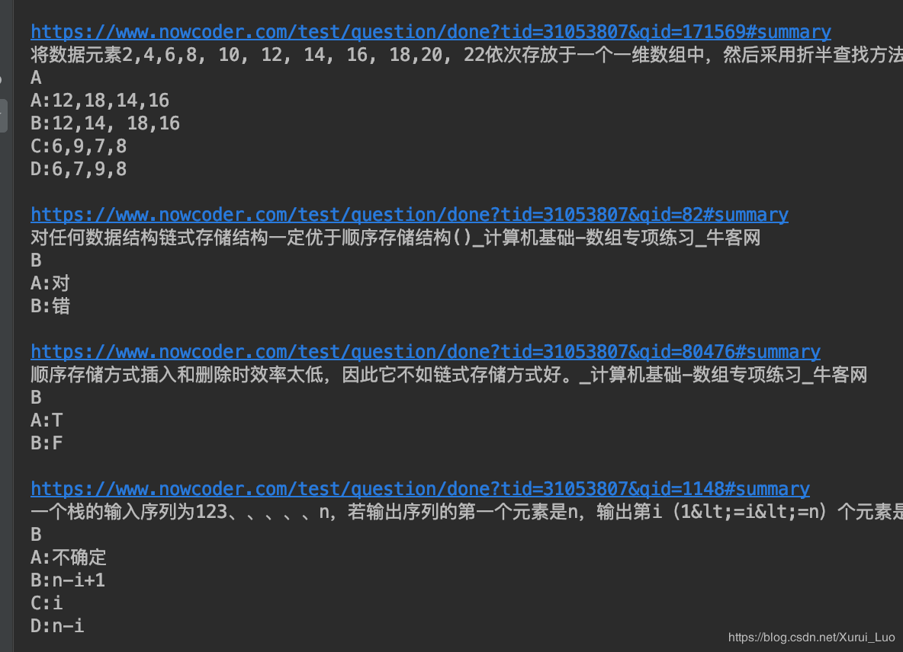

# nowcoder-crawler

## 0 Intro

爬虫实现爬取牛客网数据结构试题
[试题链接](https://www.nowcoder.com/intelligentTest)

## 1 Goal

想法就是用程序一次将30题全部爬下。随后生成新的试卷再进行爬虫。

## 2 usage 

进入网页可以看到，如果选择《数据结构》的某个知识点组卷，一次最多只能出30题。



用程序一次将30题全部爬下。随后手动生成新的试卷再进行爬虫。


### 获取试题链接和cookie

1. 进入试题解析界面，进入第一题，复制链接。
2. 在Chrome中打开开发者工具，获得与登录相关的cookie。
3. 将它们放入到下图的变量中



### 命令行执行
```
python3 nq-crawler.py 
```

## 3 Result

效果




